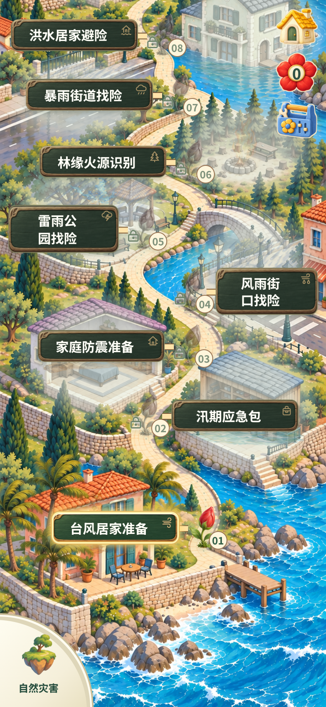

# 小红花应急行动

一款面向手机竖屏的绘本风应急科普游戏。在三张场景地图中寻找隐患、练习正确处置，让危险区域恢复安全，再种下一朵小红花。

**[在线试玩](https://keepingmoving.github.io/little-red-flower-game/) · [下载离线游戏](https://github.com/KeepingMoving/little-red-flower-game/releases/latest) · [反馈问题](https://github.com/KeepingMoving/little-red-flower-game/issues)**

当前正式地图有 **24 个可玩关卡**。首次完成每关获得 **3 朵小红花**，一位玩家的一轮完整进度最多 **72 朵**。支持开始新游戏、继续游戏、多个本机玩家和本机排行榜。无需注册账号、API Key、数据库或后端服务。

<p>
  
  
</p>

## 1. 先选一种打开方式

| 你想做什么 | 打开方式 | 开发工具 |
| --- | --- | --- |
| 马上体验 | [在线试玩](https://keepingmoving.github.io/little-red-flower-game/) | 不需要 |
| 下载后断网玩，或发给朋友 | Release 中的 `red-flower-offline.zip` | 不需要 |
| 修改代码、图片或关卡 | 下载源码后按第 5 节运行 | Node.js、pnpm |

### 下载即玩：推荐给普通玩家

1. 打开 [Releases 最新版本](https://github.com/KeepingMoving/little-red-flower-game/releases/latest)。
2. 展开 **Assets**，下载 **`red-flower-offline.zip`**。
3. **先解压**，不要在压缩软件内直接预览。
4. 双击 `小红花应急行动.html`，或右键选择“打开方式 → Edge / Chrome”。
5. 出现正式首页后即可游玩，之后无需联网。

离线包包含：

```text
小红花应急行动.html   游戏本体，脚本、字体、图片与声音已内嵌
使用说明.md          离线使用说明
导出校验.json        文件 SHA-256 与素材清单
LICENSE              许可证
```

**`Source code (zip)` 是开发源码，不是离线游戏包。**下载了源码后，需要安装依赖运行。GitHub 的 HTML 文件预览页也不能直接运行游戏。

电脑推荐现代版本的 Edge、Chrome、Firefox 或 Safari。手机请下载后使用支持本地 HTML 的浏览器打开；微信、QQ、网盘的文件预览可能无法执行脚本或保存记录，遇到白屏可换浏览器或使用在线试玩。

在线版素材较多，首次加载需要一些时间。在线试玩以最新成功的 Pages 部署为准，推送代码后需要等待 Actions 完成；需要稳定断网体验时请下载离线包。

## 2. 第一次玩：从首页到种花

1. **开始新游戏**：首次玩家从地图起点出发；已有记录时会先询问是否清空当前玩家的进度。
2. **选择区域**：点击左下角四分之一圆里的浮岛图标，进入天空群岛页。点击自然灾害、公共安全或居家校园办公岛屿，旗子移到目的地后进入对应地图；返回按钮保留原来的浏览位置。地图从下方向上探索。
3. **点击节点**：在地图上的绘本窗口阅读简短介绍，点金色开始按钮后直接游玩。点击窗口外或按 Escape 可关闭；未解锁关卡只提示前置条件，不能开始。
4. **完成目标**：点击场景中的真实隐患，或根据提示拖动物品、操作设备、完成分阶段处置。
5. **查看结算**：完成后先展示场景结果，再显示奖励与知识总结。
6. **返回地图**：首次通关获得 3 朵小红花，花坛开花、环境逐步恢复，并引导后续关卡。

| 节点外观 | 含义 |
| --- | --- |
| 低饱和、灰色花苞与锁 | 前置条件未满足，暂时不能进入 |
| 彩色花苞、柔和提示 | 已解锁，可以进入 |
| 盛开的红花 | 已完成，可以重玩，不重复领取首次奖励 |

地图仅在未解锁关卡对应的建筑或街道上显示局部薄雾，解锁后立即移除。底图保留原色，薄雾浓度不随区域通关比例变化。

解锁以具体关卡的前置条件为准，不是点击任何节点都能进入。右上角从上到下竖排显示黄色首页小屋、红花计数和蓝色花匠调节匣，均为 50 × 50px 的透明底绘本图标，配细米色轮廓；后方地图局部渐变减淡，没有按钮底板或外部投影。小屋返回首页，花芯显示真实累计数量并打开守护档案，调节匣打开游戏设置；不再保留独立成就按钮。守护档案展示花数、分类进度和本机排行榜入口，游戏设置提供声音开关和当前玩家记录重置。

### 基本操作

| 任务 | 电脑 | 手机 |
| --- | --- | --- |
| 找隐患 | 鼠标点击画面里的真实物品 | 手指点按 |
| 拖放处置 | 按住物品，拖到目标位置后松开 | 按住拖动后松手 |
| 操作设备、选择行动 | 点击提示对应的设备或操作项 | 点按对应位置 |
| 浏览地图 | 鼠标滚轮或滚动区域 | 上下滑动 |

先观察再操作。限时识别关可能因误点扣时；部分处置关允许纠正，部分危险操作会直接判定失败，具体以本关提示、倒计时和反馈为准。**失败、未完成和中途退出都不奖励小红花，也不会提前解锁。**不要把不同关卡的训练规则混为一谈。

声音在首次操作后启用。首页和地图使用「忙归忙，能搞定」循环配乐，页面之间连续播放，进入关卡时淡出，返回地图时续播。地图右上角的游戏设置中分别提供首页／地图音乐和按钮／奖励音效开关；音乐开关会保存在当前浏览器。关内音乐和环境声由对应关卡的暂停菜单控制。 电梯与井口两关已补上背景和操作声音，收纳、提示按钮以及地图种花解锁均有反馈；[本轮音效表与验收](docs/audio-feedback/README.md)。切到后台会暂停音乐，离开时可以直接关闭页面。

## 3. 新游戏、继续游戏与存档

| 功能 | 实际行为 |
| --- | --- |
| 开始新游戏 | 确认后清空**当前玩家**的花朵、完成记录与解锁进度，回到地图起点；保留昵称、地区和其他玩家记录 |
| 取消确认 | 不修改任何存档 |
| 继续游戏 | 读取已有成绩，回到上次探索的地图节点 |
| 重玩已完成关卡 | 可以重新体验，不重复累计首次奖励 |
| 添加 / 切换玩家 | 在本机排行榜操作，各玩家独立保存进度 |

“开始新游戏”不是换个入口，也不会自动备份旧进度，请看清确认提示。新一轮进度中，可以重新领取首次通关奖励。

记录保存在当前浏览器的 `localStorage`，**没有云同步**。离线游玩建议一直使用同一浏览器、同一文件路径。在线版、`localhost` 开发版与本地文件版通常使用不同的存储空间，不会自动共享记录。清理浏览器数据、使用隐私模式、更换浏览器或移动文件路径，都可能使旧记录不可见。

**继续游戏恢复地图与已完成成绩，不恢复未完成关卡中的每一步操作。**刷新未完成关卡后需要重新进入该关。浏览器禁止持久化存储时可能只能保存本次会话。本机排行榜只比较这台浏览器的玩家，不是联网排名。

## 4. 当前可玩关卡

| 地图 | 数量 | 关卡 |
| --- | ---: | --- |
| 自然灾害 | 11 | 台风居家准备、汛期应急包、家庭防震准备、风雨街口找险、雷雨公园找险、林缘火源识别、暴雨街道找险、洪水居家避险、地震室内避险、震后楼梯撤离、洪水高处待援 |
| 公共安全 | 7 | 楼道杂物清理、电梯故障待援、井口遇险求助、楼道隐患巡查、汽车落水离车、电梯定位求助、塌陷被困求救 |
| 居家校园办公 | 6 | 油锅起火处置、卧室充电巡查、睡前防火巡查、厨房开火检查、火灾隔烟待援、火灾楼梯撤离 |

名称相近也可能是不同任务，例如“楼道杂物清理”练习处置，“楼道隐患巡查”练习识别。仓库内还包含未启用草稿和制作工具，它们不计入正式地图，不代表已审校可玩。

## 5. 从源码运行

### 准备环境

- 推荐 **Node.js 24**，仓库最低要求为 `22.13.0`。
- 使用 **pnpm 11.22.0**，与 `package.json` 和 CI 一致。
- 克隆需要 Git，也可以下载 Source code ZIP 后解压。
- 首次安装依赖需要联网；运行游戏无需 `.env`、API Key 或外部服务。

```sh
node --version
npm install -g pnpm@11.22.0
pnpm --version
```

### 获取代码并安装

```sh
git clone --depth 1 https://github.com/KeepingMoving/little-red-flower-game.git
cd little-red-flower-game
pnpm install --frozen-lockfile
```

仓库包含正式美术，下载会比纯代码项目大。不要只下载 `app` 或 `components`，也不要漏掉 `public`、`content` 和锁文件。

### 启动开发服务器

```sh
pnpm dev
```

打开终端打印的 **Local 地址**，通常是 `http://localhost:3000/`，端口以实际输出为准。不要双击 TSX 源文件。

用同一局域网内的手机调试：

```sh
pnpm dev --hostname 0.0.0.0
```

手机访问电脑局域网 IP 和终端端口，例如 `http://192.168.1.10:3000/`。两台设备需在同一网络，并允许开发服务器通过防火墙。该地址与 `localhost` 的存档独立。

### 导出可双击的离线版

```sh
pnpm export:offline
```

产物在 `outputs/本地离线版/`。等待终端报告导出成功后，双击其中的 `小红花应急行动.html`，或将它与说明、许可证一起发给别人。

**修改源码或图片后必须重新导出**，旧 HTML 不会自动更新。`pnpm build` 是正式应用构建，不会替代离线导出。要生成 Pages 静态产物，使用 `pnpm build:site`，输出目录为 `site/`。

### 验证代码

```sh
pnpm test             # 规则、存档与关卡流水线测试
pnpm test:art         # 厨房正式素材检查
pnpm typecheck       # TypeScript 类型检查
pnpm build           # 正式构建
```

一次执行以上检查：

```sh
pnpm verify
```

地图与存档专项为 `pnpm test:journey`，排行榜专项为 `pnpm test:leaderboard`。浏览器自动化是额外验收，部分脚本带有本机 Playwright/Edge 路径，换电脑前需配置；它们不是普通游玩或 `pnpm verify` 的前置条件。

## 6. 以后如何更新 GitHub

### 更新源码和在线试玩

修改后，在仓库根目录执行：

```sh
pnpm install --frozen-lockfile
pnpm verify
git status
git add .
git diff --cached
git commit -m "更新关卡或界面"
git push origin main
```

检查暂存内容后再提交，不要上传账号密钥、本地存档或依赖目录。`.gitignore` 已忽略 `node_modules/`、`outputs/`、`dist/`、`work/`、`site/index.html` 等产物；历史已跟踪的文件不会因为新增忽略规则自动取消跟踪。

推送 `main` 后，在仓库 **Actions** 查看 **Verify game** 和 **Deploy playable game**。部署成功后在线试玩才会更新；离线玩家需要重新下载新版本，不会自动升级。

### 发布新版离线包

在准备发布的提交上创建**尚未使用过**的版本标签，例如：

```sh
git tag v0.2.1
git push origin v0.2.1
```

`v*` 标签触发 **Release offline game**：安装依赖 → 验证 → 导出 → 压缩 → 创建 Release。完成后 Releases 中会出现 `red-flower-offline.zip` 和 `SHA256SUMS.txt`。请替换示例版本号，不要覆盖已发布标签。

不要把生成的巨大 HTML 用 `git add -f` 强行提交。GitHub 普通 Git 仓库有单文件大小限制，离线包通过 Release 分发；`site/index.html` 由 Actions 生成，不纳入源码提交。[GitHub 大文件说明](https://docs.github.com/en/repositories/working-with-files/managing-large-files/about-large-files-on-github)

### 上传到自己的仓库

优先 Fork，或将克隆仓库的 `origin` 改为自己新建的空仓库地址，再推送。保留 `.github/workflows/`，允许 Actions 运行，并在 **Settings → Pages → Source** 选择 **GitHub Actions**。修改本 README、克隆命令和贡献指南中指向原仓库的链接。

Pages 构建命令为 `pnpm build:site`，产物目录为 `site/`；不需要上传 Node 开发服务器或 `node_modules`。

## 7. 目录与修改入口

```text
app/game/                 关卡注册、规则、状态模型
  journey/                地图进度、解锁与继续位置策略
  leaderboard/            本机玩家、奖励和存档服务
  scene-hunt/             整场景找隐患引擎
  runtime/                配置驱动的互动处置引擎
  disaster/               灾害专用玩法
  kitchen/                厨房专用玩法
components/game/          首页、地图、玩家视图、Canvas 渲染与输入
content/                  规则、皮肤、文案、清单和地图配置
public/                   运行所需正式图片、声音、字体
art-source/               制作元数据、提示词与采样记录
tests/                    自动测试与测试夹具
scripts/                  关卡制作、验证、构建与离线导出
offline/                  离线启动入口和使用说明
docs/                     开发文档、知识依据与验收记录
.github/workflows/        代码验证、Pages 部署和 Release 发布
```

大型制作中间图和批量验收截图不随本次源码包完整分发，运行所需素材均在 `public/`。不要把测试夹具或退役模板直接复制为正式关卡。

| 想修改什么 | 优先修改位置 |
| --- | --- |
| 首页标题、按钮文字、插画 | `content/journey-home.json` |
| 地图显示的关卡名称 | `content/journey-copy.json` |
| 三张地图、节点位置、前置关系 | `content/journey-map.json` |
| 未解锁建筑、街道的局部薄雾范围 | `content/journey-fog.json` |
| 花朵、地图表现资源 | `content/journey-skin.json` 及相关配置 |
| 首页和地图共用画面宽度 | `app/journey-frame.css` |
| 玩家存档与奖励 | `app/game/leaderboard/`、`app/game/journey/` |
| 关内目标、规则 | 对应规则 JSON，勿写入 CSS 或图片 |
| 关内图片、坐标、演出 | 对应皮肤与演出 JSON |

显示名称可以改，**正式关卡 ID 不要随意改**，否则旧存档和前置关系可能失去对应。新关默认应保持关闭，完成内容、素材与安全审校后再加入地图。

- [地图与小红花模块](docs/flower-journey/README.md)
- [角落工具与扇形地图切换](docs/flower-journey/MAP-FAN.md)
- [早期顶部轮盘与独立美术素材](docs/flower-journey/MAP-WHEEL.md)
- [首页与继续游戏](docs/flower-journey/TITLE-SCREEN.md) · [开始新游戏](docs/flower-journey/NEW-GAME.md)
- [找隐患唯一现行流水线](docs/hunt-pipeline/README.md) · [AI 制作入口](docs/hunt-pipeline/AI_START.md)
- [处置关工作流](docs/response-workflow/README.md)
- [模块化关卡制作手册](docs/模块化关卡制作手册.md)
- [贡献指南](CONTRIBUTING.md)

放置测试引擎是制作人员的 [开发工具](docs/placement-engine/README.md)，不是玩家首页或守护档案的正式入口。

## 8. 常见问题

| 问题 | 处理方式 |
| --- | --- |
| ZIP 中找不到可双击游戏 | 下载 Release 的 `red-flower-offline.zip`，不要误选 Source code |
| 打开 HTML 是代码或白屏 | 先解压，再用现代浏览器打开，不用文本编辑器或聊天软件预览 |
| 改代码后离线版没变化 | 重新 `pnpm export:offline`，再刷新正确路径的 HTML |
| 关卡灰色、无法进入 | 检查前置关卡和当前玩家 |
| 重玩没再加 3 朵花 | 正常，每轮每关只领取一次首次奖励 |
| 继续按钮不可用 | 当前玩家无可继续记录，或浏览器、地址、文件路径发生变化 |
| 没有声音 | 先点击开始，再检查游戏内开关和浏览器标签页是否静音 |
| 找不到 `pnpm` | 安装指定版本后重新打开终端；Windows 可尝试 `pnpm.cmd` |
| 安装提示锁文件不一致 | 使用仓库对应 pnpm；改依赖后重新生成并提交锁文件，不要随意删除它 |
| 推送后在线仍是旧版 | 检查 Actions 部署结果，完成后刷新或强制刷新 |
| 本机记录消失 | 检查浏览器、玩家、访问地址与文件路径；项目没有云端备份 |

## 9. 许可证与内容说明

代码使用 [MIT License](LICENSE)。随仓库分发的字体保留各自 OFL 许可证，使用第三方素材时请继续保留对应声明。游戏用于科普学习，不替代真实事故中的专业救援、现场指挥和官方应急指引。
