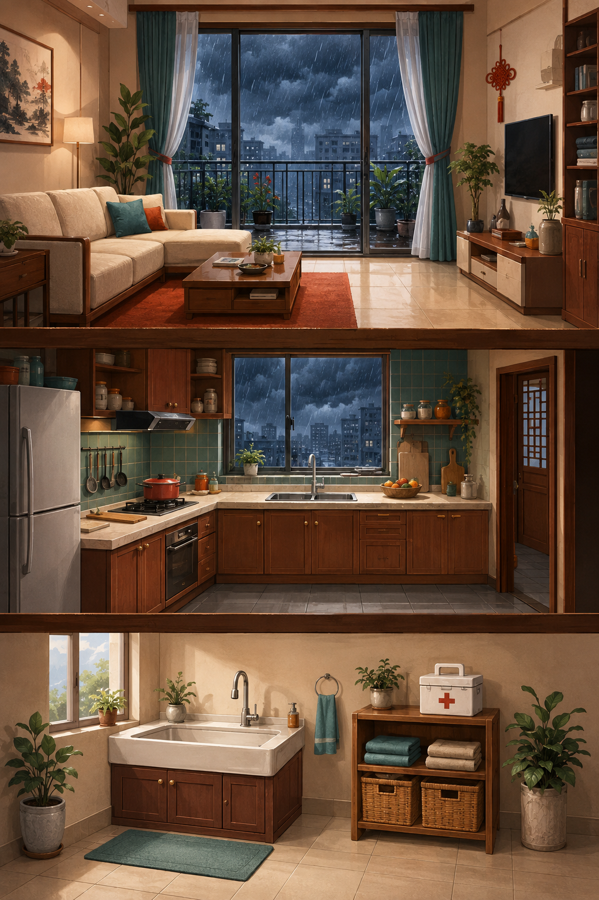

# 小红花游戏

面向手机竖屏的公益应急科普 HTML 游戏。当前本地版本包含六个可完整游玩的关卡：

- 《台风前的家》：在一幅完整绘本场景中识别 5 处隐患，以红圈标记；找齐后展示规范处置后的安全效果图。
- 《厨房着火了》：点击关闭燃气、拖动锅盖覆盖油锅，再将人物撤离到门外安全区。
- 《汛期应急包》：找到五类备灾物品，逐件收入应急包。
- 《畅通的生命通道》：日常清理楼道，将四件杂物收进自家储物间。
- 《电梯停住了》：使用报警通话装置，留在轿厢内等待专业救援。
- 《井口边的求助》：劝阻靠近、在外围模拟联系 119 和 120，不下井施救。

新增四关来自 53 篇文字稿的首批筛选。全部稿件的设计方向、删除的模糊说法和后续审核门禁见 [全量筛选与首批关卡设计](docs/transcript-batch-v1/全量筛选与首批关卡设计.md)。这不代表 53 篇都已制作或通过专业认证。内部编号 03—08 保留给既有草稿和模板，新关编号为 09—12。



## 在线游玩

[点击在线游玩](https://keepingmoving.github.io/little-red-flower-game/)。在线版本以最近一次成功部署为准；本轮新增内容保存在本地，尚未提交或发布到 GitHub。重新生成的单文件离线版不依赖网络接口或外部素材。

也可以下载仓库 Release 中的离线包，解压后双击 `小红花应急行动.html`。

## 本地开发

需要 Node.js 22.13 或更高版本，以及 pnpm 11。

```powershell
git clone https://github.com/KeepingMoving/little-red-flower-game.git
cd little-red-flower-game
pnpm install
pnpm dev
```

浏览器打开 <http://localhost:3000/>。

## 验证与导出

```powershell
pnpm test
pnpm test:art
pnpm typecheck
pnpm build
pnpm export:offline
```

也可以一次执行完整检查：

```powershell
pnpm verify
```

离线导出位于 `outputs/本地离线版/`。`outputs/` 是本地生成目录，不提交到 Git。推送到 `main` 后，GitHub Actions 会重新生成 `site/index.html` 并自动部署公开试玩页；也可在本地执行 `pnpm build:site` 更新它。

## 主要目录

```text
app/game/                 关卡配置、状态模型和规则
app/game/runtime/         两类新关共用的数据引擎与契约校验
content/                  原关皮肤、新关规则包、两类模板和清单
components/game/          关卡 UI、Canvas 渲染与输入
public/levels/            正式分层美术资源
tests/                    关卡规则与回归测试
scripts/                  测试、美术检查和离线导出工具
docs/                     关卡说明、AI 生产规范和模板
site/                     GitHub Pages 单文件试玩版
```

## 换画风与批量新增关卡

台风关现使用 `content/scenes/typhoon-home/{rules,skin}.json` 与 `app/game/scene-hunt/`。完整原画、ID 蒙版、同源人物、安全结局独立配置；目标不再移动，人物后方的风雨随时间增强，音频不含 AI 朗读。具体步骤、验收与禁止事项见 [台风整场景 AI 执行工作流](docs/typhoon-immersion-v2/AI执行工作流.md)。

厨房仍修改 `content/presets/kitchen/skin.json`；通用新关使用 `content/levels/`。旧 `content/presets/typhoon/skin.json` 仅对应保留的历史实现，不是当前台风入口。新关规则和皮肤分离；两个配置示例默认隐藏，不影响当前游玩内容。

```powershell
pnpm levels:create --id my-prevention --kind prevention --title 我的防范关卡 --order 9
pnpm levels:check
pnpm test:pipeline
```

这会建立可运行的模板草稿，不会根据标题自动产生新美术或正确科普知识。换皮肤、前置解锁、关键帧、批量清单、启用、导出和 AI 验收规则，详见 [模块化关卡制作手册](docs/模块化关卡制作手册.md)。旧的 [AI 生产规范](docs/AI关卡生产流水线执行规范.md)仍保留美术和内容审核流程，运行接口以新手册与 `schema.ts` 为准。

## 协作

欢迎提交 Issue 和 Pull Request。开始前请阅读 [CONTRIBUTING.md](CONTRIBUTING.md)。

代码与仓库内可再分发素材按 [MIT License](LICENSE) 开放。公益科普内容不能替代消防、应急管理或医疗机构的专业指导。
