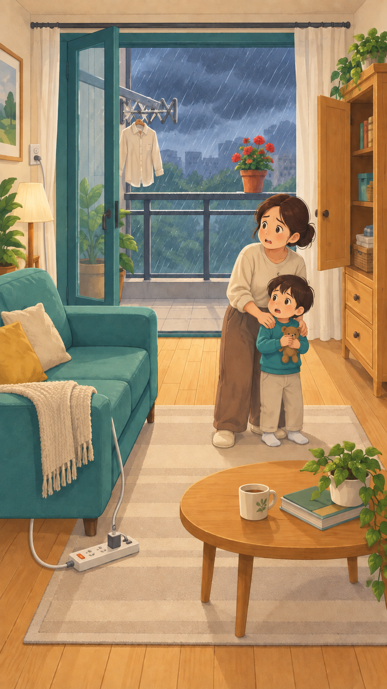
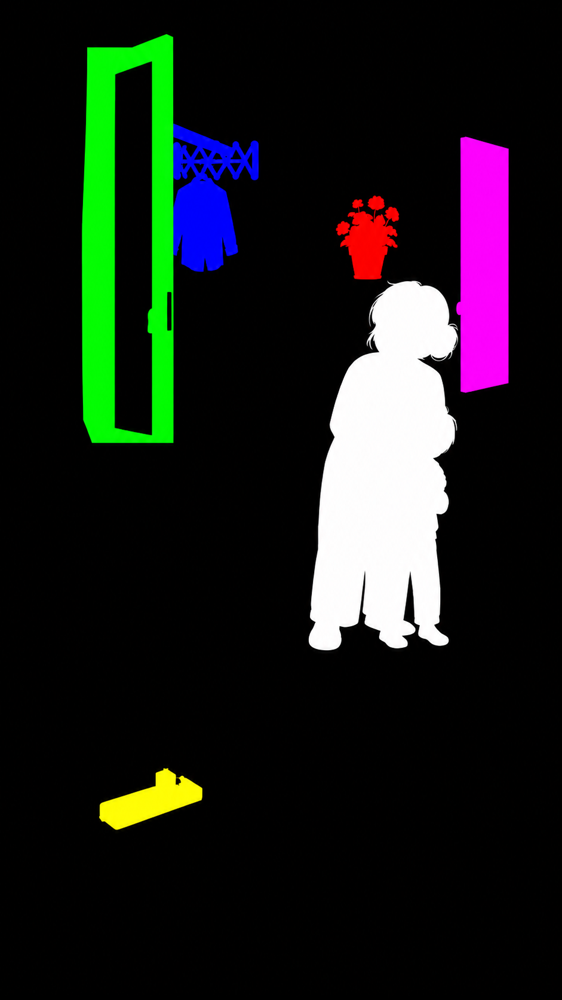

# 这一关究竟怎么做的

以下描述依据 2026-09-09 当前源码核对。留档时 HEAD 为 `7541b39cb1da79e7257c9fcf184fbe05c7ea0feb`，工作树干净；具体核对文件和哈希见 `source-audit.json`。这只是留档时点，后续制作应重新检查源码，不能把历史测试记录当成新修改的验收结果。

## 一、先画完整场景，再派生资产

上一轮不是“空房间 + 五张独立物品贴图”。实际过程为：

1. 参考厨房绘本的纸纹与青绿/暖木配色，生成客厅、阳台、五个隐患和母子同在一张图里的完整不安全状态。
2. 首轮把插座画到沙发上，单独用局部编辑提示词修正到真实墙面。修正图成为后续唯一母版。
3. 从母版生成同构纯色语义蒙版：五个目标五种颜色，母子白色，其他黑色。
4. 从同一母版生成“只移除母子”的补空候选；用程序提取原画母子并细化透明边缘。
5. 从同一母版生成完整安全状态：门窗闭合、花盆等物品收妥、断开闲置插线板、高柜固定、母子坐下。
6. 编程连接点击、描圈、环境增强、音乐音效、人物轻微动作、结局和离线导出。

也就是四类原始图（母版/蒙版/补空/结局），另有一次必要的物理纠错。各派生图参考同一已批准母版；不是互不相关地生成四张“类似房间”。

## 二、从四类原图得到哪些运行文件

原轮四张图均为 941×1672，程序统一到 720×1280。新关不必要求模型恰好输出 941×1672，但所有同构输入的真实宽高必须一致；不一致须先查原因，不允许靠拉伸掩盖构图变化。

|运行文件|怎么得到|运行用途|
|---|---|---|
|`scene.webp`|完整原图转换为无损 WebP|关卡预览；制作/校验基准|
|`clean.webp`|从补空候选中只取人物附近区域，与母版合成|游戏实际底图，五个隐患仍是母版像素|
|`family.png`|母版像素 + 细化人物 alpha，裁成局部图|在原位置做人物动态|
|`targets-mask.png`|量化五色蒙版，去掉白色人物|不可见的点击判定图|
|五张 `*-icon.png`|母版按目标蒙版裁切|顶部剪影，UI 以黑色显示|
|`safe.webp`|完整安全状态图转换为无损 WebP|全部找到后的整幅结局|

共 10 份运行图像。`mask-generated.png` 是 AI 生成候选，`targets-mask.png` 才是处理后的运行蒙版，二者不能混用。母子的白色提取区域不会作为玩家目标。

## 三、像素处理实际细节

现有 `scripts/prepare-typhoon-scene.py` 的行为：

1. 图片用 Lanczos 重采样；ID 蒙版用最近邻，避免把颜色混出新 ID。
2. 以每通道差值小于 85 提取五种颜色，再输出精确 RGB。检查区域非空和不交叠。这是本关候选蒙版的加工配方，不是任意画面的可靠分割器。
3. 先从目标区域裁图标；窗门的命中区域再填闭合孔洞，因此玻璃可点击，但图标保留中空门框。
4. 人物从白色区域开始，用 GrabCut 做 4 次细化：白区内腐蚀 5 像素作确定前景，外围用 21 像素最大值滤波扩出候选区；最终 alpha 做 0.35 像素高斯柔化。
5. 人物原画裁框记录为 `{x:393,y:357,w:197,h:477}`。这个数值是这张画的结果，换图后必须重新计算。
6. **实际补空采用人物包围矩形外扩 6 像素、羽化 4 像素的区域，不是严格人物轮廓补空。** 所有目标蒙版像素强制排除，矩形之外没有被采纳的候选重绘。
7. 检查补空区域外像素完全不变，再另用 `check-scene-hunt-art.py` 检查五种目标区域在 `scene.webp` 与 `clean.webp` 中完全相等。

这解释了为什么不再出现物品矩形贴片：没有用安全物件图覆盖旧物件，也没有在点击时搬动另画的道具。注意：像素检查只证明检查范围没有改写，不证明 AI 蒙版选对了真实物体，所以仍需看叠加图。

## 四、点击与剪影如何对应

|ID|蒙版颜色|包含的对象|红圈依据|
|---|---|---|---|
|plant|255,0,0|花盆及红花枝叶|该目标包围范围|
|window|0,255,0|敞开门扇和其玻璃|门扇包围范围|
|rail|0,0,255|晾衣杆和一件上衣|组合物包围范围|
|powerstrip|255,255,0|插线板及插入的充电器，不含长电线|本体包围范围|
|cabinet|255,0,255|敞开柜门，不含下方普通抽屉|门扇包围范围|

浏览器坐标先减去画布位置和 contain 留边，再除以缩放比例，得到逻辑坐标。读取 `targets-mask.png` 对应像素，按 RGB 匹配目标。透明、黑色和画外无目标。**红圈的椭圆不是点击区域，包围矩形也不是点击区域。**

点击开始后，状态记录 `marking={id,age:0}`；800ms 到达前不提交 found。正在描圈时新的目标点击被忽略。已找到的目标再次点击也不会重复计数。

## 五、演出和结算时序

状态路径：`ready → playing → reveal → complete`；重玩回到 `ready`。暂停是播放器状态，暂停时不向模型送 tick。

- ready：图片加载好再开放进入；没有持续增加的时间压力，也不自动播放声音。
- playing：`pressure=min(1,elapsed/90000)`；风雨、色调和人物动态随此值加强。误点只有 420ms 轻反馈、不扣分；到 90 秒后仍可继续。
- 每次发现：800ms 描圈，之后累计 found，简短单条提示和发现音。没有移动花盆、收衣杆、拔插头等过程动画。
- 第五项提交：立即进入 reveal。描圈完成后的前 800ms 保留已识别场景，800–2600ms 交叉淡入完整安全图，5500ms 时进入结算。
- complete：发放 3 朵花，通过现有 `onFinish` 写入最好成绩；重复训练不累计刷花。

800/1800ms 淡化时间目前写在 renderer 内，`revealMs` 写在规则内。改变后者不能假装同步改变所有时长；当前生产值 5500ms 与渲染时序匹配。

## 六、人物为什么能动，雨为什么不会落到脸上

母子透明图来自原画，脸、衣服和笔触没有重新另画。绘制时以脚部为锚，把图分成 36 条；上半身有轻微呼吸形变、倾斜和随风险增强的轻颤，下方运动更小。它仍是一幅姿势图，**没有独立的惊慌/专注表情帧，也没有骨骼或嘴型动画**。结局坐姿来自整幅安全图。

实际顺序：完整底图 → 窗外裁剪雨层/门口少量雨和环境暗角 → 人物及脚底阴影 → 红圈/误点反馈 → 安全整图 → 简洁界面。

雨层必须在人物之前绘制；人物不透明像素自然遮住其后的雨。脸旁曾加的蓝色汗滴被用户认为像雨，已经删除。不能在最上层再画一遍全屏雨，不能用“更紧张”作为穿帮理由。

## 七、音效和界面实际范围

音乐、风雨声、雷声和交互提示全部由 `HuntSound` 在本地 Web Audio 中合成，无网络音频和朗读文件。音乐用音列/节奏，环境用滤波噪声，发现与结算用短音序；风险增长影响音量、频率与节奏。完成后降低环境声并换舒缓音列。

用户明确不要 AI 朗读，所以本轮最终代码没有 TTS 或“人物语音”开关。音效保留。首次进入后解锁声音，暂停/后台压低总音量，离开组件停止声源并关闭 AudioContext。静音设置当前仅保留在该播放器实例，退出后重进会重新初始化；不是已实现跨会话音量偏好存档。

常驻界面只有返回、编号标题、环境时间、暂停、五个剪影。字幕只短暂出现，音量/提示/重玩收进暂停菜单。没有步骤答案栏。

## 八、能复用到什么程度

已可复用：纯状态机、命中函数、坐标转换、红圈机制、图层思路、离线导出与素材检查方法。

只换图也必须更新：人物裁框、目标蒙版/圈范围、剪影、窗外与门口天气区域。若只是同构画风替换，应保持 rules/目标 ID/存档不变并核对哈希。

新增主题仍需处理的专用项：

- `prepare-typhoon-scene.py` 的输入输出目录、五 ID、窗门填孔规则、天气区域写死，且会直接重写旧 skin；不要对新关原样运行。
- `registry.ts` 仅静态注册台风；关卡列表元数据在 `app/game/levels.ts`，台风仍带兼容旧引擎标签，实际由 `getHunt()` 优先接管。仅把文件放进 `content/scenes/` 不会自动出现在地图中。
- `player.tsx` 有 `LEVEL 01`、五处隐患、台风和风雨的专用文字。
- renderer 和 sound 的风雨、人物运动、结算节奏还是本关表现，不是任意灾害效果配置器。
- 没有接入前置物品揭示功能：本版不再要求先掀坐垫，也没有雨伞遮挡。不能同时宣传旧版前置链已保留。

这些是下一次通用化的明确改造清单，不是本次文档任务里已经完成的功能。

## 九、验证的事实边界

上一轮记录为 477 项测试及构建通过，其中新识别引擎 133 项含 120 种顺序；剩余测试是其他模块/历史引擎回归。最后移除朗读、调整雨层后做了静态渲染及代码回归，没有再次打开有声页面完成连续浏览器验收。本次仅核对代码并测试文字工作流工具，不重新声称完成真机验收。
